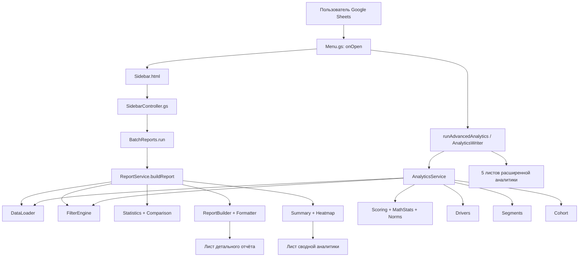
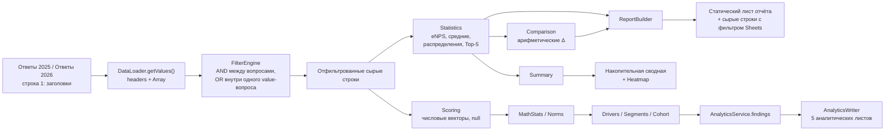

# Техническая документация HR Survey Analytics

## 1. Статус документа и область проверки

Документ описывает фактическое состояние текущего рабочего дерева репозитория на 30.07.2026, включая незакоммиченные файлы и изменения. Источником истины для поведения системы считался исполняемый код, а существующая документация использовалась как дополнительный источник требований и истории.

Проверено:

- 42 поля анкеты из `src/Questions.gs`;
- основной контур построения отчёта из Sidebar;
- расширенный аналитический контур из меню Google Sheets;
- конфигурация Apps Script и clasp;
- все существующие документы, в том числе RTF-файлы с расширением `.md`;
- синтаксис всех 33 файлов `.gs`;
- четыре имеющихся набора ручных тестов.

В репозитории нет выгрузки рабочей Google-таблицы. Поэтому код и тестовые фикстуры проверены локально, но актуальные численные результаты, права доступа, триггеры и визуальное оформление листов должны быть проверены в привязанной Google-таблице. Источники: `.clasp.json`, `src/appsscript.json`, `src/EnpsConsistencyTest.gs`, `src/DepartmentAliasesTest.gs`, `src/SegmentsTest.gs`.

## 2. Назначение проекта

Проект — привязанное к Google Sheets приложение на Google Apps Script для анализа ежегодного HR-опроса сотрудников. Оно решает две связанные задачи:

1. Формирует статический, оформленный отчёт по выбранному году и произвольному срезу анкеты.
2. Строит расширенную аналитику по всей компании: светофор показателей, статистическую динамику, драйверы eNPS, отклонения сегментов, изменение состава и сквозную когорту.

Приложение рассчитано на конкретную фиксированную анкету и конкретные листы `Ответы 2025` и `Ответы 2026`; универсального конструктора анкет нет. Источники: `src/DataLoader.gs` — `loadSurveyData`; `src/Questions.gs` — `Questions.catalogue`; `src/AnalyticsWriter.gs` — `runAdvancedAnalytics`.

Исходные листы не изменяются. Основной контур создаёт или пересоздаёт лист отчёта и обновляет накопительный лист сводной аналитики. Расширенный контур создаёт либо очищает и заполняет пять листов с фиксированными именами. Источники: `src/ReportBuilder.gs` — `createReport`; `src/Summary.gs` — `update`; `src/AnalyticsWriter.gs` — `sheet_`, `run`.

## 3. Основные пользовательские сценарии

### 3.1. Обычный отчёт по компании или срезу

1. Пользователь открывает таблицу.
2. `onOpen()` создаёт меню `HR Analytics`.
3. Пункт `Создать отчет` открывает Sidebar.
4. Пользователь выбирает 2025 или 2026 год.
5. Пользователь добавляет фильтры, при необходимости включает сравнение 2026 с 2025 и задаёт имя листа.
6. Нажатие `Создать отчет` запускает расчёты и формирует лист отчёта.
7. После успешной сборки обновляется строка соответствующей выборки в листе `Сводная аналитика`.

Источники: `src/Menu.gs` — `onOpen`; `src/SidebarController.gs` — `showSidebar`, `buildReportFromSidebar`; `src/Sidebar.html`; `src/ReportService.gs` — `buildReport`.

### 3.2. Пакет отчётов

Для фильтра по значениям пользователь может выбрать режим «отдельный отчёт для каждого выбранного значения». Каждый такой фильтр разворачивается независимо: два значения города и три значения отдела дадут пять отчётов, а не декартово произведение из шести комбинаций. Обычные фильтры добавляются в каждый пакетный отчёт; другие пакетные фильтры из него исключаются. Ошибка одного отчёта не отменяет остальные. Источник: `src/BatchReports.gs` — `run`, `expandFilterSets`.

### 3.3. Расширенная аналитика

Пункт меню `Расширенная аналитика` всегда запускает анализ `2026` против `2025` без фильтров и перезаписывает листы:

- `Выводы`;
- `Светофор`;
- `Драйверы`;
- `Отклонения срезов`;
- `Когорта`.

Сервисный метод `AnalyticsService.build` принимает фильтры, но публичный пункт меню передаёт пустой массив. Через текущий Sidebar отфильтрованную расширенную аналитику запустить нельзя. Источники: `src/AnalyticsWriter.gs` — `runAdvancedAnalytics`, `AnalyticsWriter.run`; `src/AnalyticsService.gs` — `build`. <!-- PROMPT-001: Спроектируй поддержку расширенной аналитики по срезам, в первую очередь по департаментам. Опиши изменения в Sidebar, передачу фильтров в AnalyticsService, правила формирования выходных листов и ограничения для малых выборок. -->

### 3.4. Обслуживание отчётных листов

- При переименовании листа отчёта installable on-change-триггер синхронизирует заголовок отчёта и подпись ссылки в сводной.
- Пункт меню `Убрать из сводной строки без отчета` удаляет строки сводной, чьи целевые листы уже удалены.
- Повторная сборка отчёта с той же сигнатурой удаляет старый лист и создаёт новый на том же месте.

Источники: `src/Menu.gs` — `onSpreadsheetChange`, `syncSheetNames_`, `pruneSummaryDeletedSamples`; `src/ReportBuilder.gs` — `getReportKey_`, `createReport`; `src/Summary.gs` — `syncSampleNames`, `pruneDeletedSamples`.

## 4. Общая архитектура

Проект использует глобальные функции и объекты Apps Script, а не систему модулей ES. Все `.gs` внутри проекта попадают в одно глобальное пространство выполнения.



### 4.1. Основной контур

`ReportService.buildReport` координирует загрузку, фильтрацию и базовые расчёты. `ReportBuilder` отвечает за структуру листа, но также содержит часть прикладной логики Short Summary: темы комментариев, агрегированные категории, пороги заметных изменений и интерпретацию структуры eNPS. `Formatter` применяет визуальное оформление. `Summary` раскладывает готовый `reportData` в фиксированную таблицу, не пересчитывая базовые показатели.

### 4.2. Расширенный контур

`AnalyticsService` кодирует ответы в числовые векторы, рассчитывает светофор и вызывает `Drivers`, `Segments`, `Cohort`. `AnalyticsWriter` преобразует результат в пять листов. В отличие от основного контура, здесь применяются доверительные интервалы, z- и t-критерии, корреляции Спирмена, нормализация 0–100 и фиксированные пороги статусов. <!-- PROMPT-002: Добавь понятную методологическую инструкцию по каждому упомянутому методу: доверительным интервалам, z-критерию, t-критерию, корреляции Спирмена, нормализации 0–100 и порогам статусов. Для каждого метода дай простое объяснение, формулу или алгоритм, числовой пример, правила интерпретации и ограничения. -->

### 4.3. Поток данных



## 5. Структура репозитория

### 5.1. Корень

| Путь | Назначение |
|---|---|
| `.clasp.json` | Связь с удалённым Apps Script-проектом; `rootDir` равен `src`. |
| `.claude/settings.local.json` | Локальные разрешения инструмента разработки; в Apps Script не разворачивается. |
| `.obsidian/` | Метаданные локального редактора Obsidian. |
| `docs/` | Устаревшая спецификация, README и инструкции для AI-агентов. |
| `src/` | Разворачиваемый исходный код Apps Script и HTML Sidebar. |
| `Бэклог.md` | Нереализованные либо частично реализованные требования. |
| `TECHNICAL_DOCUMENTATION.md` | Настоящий документ. |

### 5.2. Ключевые исполняемые файлы

| Файл | Ответственность и ключевые точки |
|---|---|
| `src/Menu.gs` | Меню, `onOpen`, installable on-change-триггер, ручная очистка сводной. |
| `src/SidebarController.gs` | Серверный API Sidebar: сведения о листе, каталог фильтров, запуск отчёта. |
| `src/Sidebar.html` | HTML/CSS/JS интерфейса, фильтры, две преднастроенные группы отделов, пакетный режим. |
| `src/DataLoader.gs` | Чтение листов и кэш на время одного запуска; данные остаются двумерными массивами. |
| `src/Questions.gs` | Фиксированный каталог 42 полей, типы, варианты, признаки отчёта/фильтра/среднего. |
| `src/Filters.gs` | Операторы и варианты фильтров; сортировка города/отдела по частоте. |
| `src/FilterEngine.gs` | Применение AND/OR-фильтров и канонизация отделов. |
| `src/DepartmentAliases.gs` | Реестр трёх известных переименований/опечаток отделов. |
| `src/Statistics.gs` | Базовые eNPS, средние, распределения, частоты и Top-5. |
| `src/Comparison.gs` | Сопоставление уже рассчитанных результатов 2026 и 2025. |
| `src/BatchReports.gs` | Разворачивание пакетных фильтров и изоляция ошибок отдельных отчётов. |
| `src/ReportService.gs` | Оркестратор основного контура и сборка `reportData`. |
| `src/ReportSections.gs` | Порядок и состав шести визуальных секций. |
| `src/ReportBuilder.gs` | Создание листа, Short Summary, KPI, таблицы, компактные бары, сырые данные. |
| `src/Formatter.gs` | Цвета, шрифты, числовые форматы, группировка строк и RichText-бары. |
| `src/Summary.gs` | Долгоживущая сводная из 41 пользовательского и одного скрытого служебного столбца. | <!-- PROMPT-003: Уточни, какие данные хранятся в скрытом служебном столбце сводной, как они формируются, где используются и почему столбец скрыт от пользователя. -->
| `src/Heatmap.gs` | Относительная подсветка positive share для yes/no-вопросов в сводной. | <!-- PROMPT-004: Диагностируй, почему подсветка Heatmap для yes/no-вопросов может не работать. Проверь входные значения, диапазоны, metadata, условия n и разброса, локаль и форматирование; предложи исправление и сценарий проверки в Google Sheets. -->

### 5.3. Расширенная аналитика

| Файл | Ответственность |
|---|---|
| `src/Scoring.gs` | Кодирование шкал в числа, eNPS-категории, охват, positive/bottom share. |
| `src/MathStats.gs` | Описательная статистика, ранги, Спирмен, z-тест, Уэлч, парный t, интервал eNPS. |
| `src/Norms.gs` | Пороги светофора, нормализация 0–100, отклонения от нормы, группа «затрудняюсь». | <!-- PROMPT-005: Объясни простыми словами, что означает нормализация показателя к шкале 0–100. Покажи исходную шкалу, формулу преобразования, два числовых примера и объясни, как читать результат. -->
| `src/Drivers.gs` | Корреляции, квадранты приоритетов, разрыв промоутеры–критики, матрица целей. |
| `src/Segments.gs` | Срезы, городская нормализация, отклонения, динамика сегментов, изменение состава. |
| `src/Cohort.gs` | Сопоставление одинаковых сотрудников и парная динамика. |
| `src/AnalyticsService.gs` | Оркестрация расширенных расчётов и детерминированные текстовые выводы. |
| `src/AnalyticsWriter.gs` | Создание/очистка пяти выходных листов. |
| `src/МЕТОДИКА.md` | Методологическое описание, частично устаревшее относительно текущего кода. |

### 5.4. Тесты и пустые файлы

`DepartmentAliasesTest.gs`, `EnpsConsistencyTest.gs`, `SegmentsTest.gs` и `ReportYearTest.gs` — ручные Apps Script-тесты без фреймворка. Они разворачиваются вместе с production-кодом, потому что `.claspignore` отсутствует. <!-- PROMPT-006: Подробно объясни, что такое ручные Apps Script-тесты без фреймворка, как их запускать и как интерпретировать результат. Отдельно объясни, почему отсутствие .claspignore приводит к публикации тестов вместе с production-кодом и какие риски это создаёт. -->

`About.gs`, `Code.gs`, `Config.gs`, `Constants.gs` и `Main.gs` имеют размер 0 байт и не участвуют в выполнении. Это важно: фактическая точка входа находится не в `Main.gs`, несмотря на утверждение старой спецификации.

## 6. Технологии и зависимости

- Google Apps Script, runtime V8.
- Google Sheets API через встроенный сервис `SpreadsheetApp`.
- HTML Service для Sidebar.
- Встроенные сервисы `ScriptApp`, `Utilities`, `Session`.
- Developer metadata Google Sheets для идентификации отчётов, сводной и хранения значений heatmap.
- clasp для синхронизации каталога `src` с Apps Script; локально обнаружена версия 3.3.0, но версия не закреплена в проекте.
- Внешние шрифты Google Fonts `Manrope` и `Inter` в `src/Sidebar.html`.

Сторонних JavaScript-библиотек, `package.json`, lock-файла и объявленных Apps Script libraries нет. `src/appsscript.json` задаёт `Europe/Moscow`, `STACKDRIVER`, V8 и пустой объект `dependencies`.

## 7. Точки входа и последовательность выполнения

### 7.1. Автоматические и меню

| Точка входа | Назначение |
|---|---|
| `onOpen()` | Создать меню и попытаться установить on-change-триггер. |
| `onSpreadsheetChange(e)` | При `changeType === "OTHER"` синхронизировать переименованные листы. | <!-- PROMPT-007: Объясни назначение функции onSpreadsheetChange(e) простыми словами: когда она запускается, что означает changeType OTHER, какие переименования синхронизирует и что произойдёт, если триггер не установлен. -->
| `showSidebar()` | Открыть Sidebar. |
| `pruneSummaryDeletedSamples()` | Удалить из сводной строки без существующего листа отчёта. |
| `runAdvancedAnalytics()` | Построить расширенную аналитику 2026 против 2025 без фильтров. |

Источники: `src/Menu.gs`, `src/SidebarController.gs`, `src/AnalyticsWriter.gs`.

### 7.2. Серверные вызовы Sidebar

- `getSurveyInfo(source)` возвращает только имя источника, число строк, число столбцов и заголовки; интерфейс показывает лишь первые три поля.
- `getFilterableQuestions(source)` возвращает 37 фильтруемых вопросов, операторы или каталог вариантов.
- `buildReportFromSidebar(...)` устанавливает триггер и вызывает `BatchReports.run`.

### 7.3. Последовательность обычного отчёта

1. `BatchReports.run` определяет одиночный или пакетный режим.
2. `buildReport` загружает выбранный лист.
3. `FilterEngine.applyFilters` формирует выборку.
4. `Statistics` считает eNPS, 16 средних, 36 распределений и два Top-5.
5. Для сводной система пытается загрузить оба года независимо от флага сравнения.
6. Если выбран 2026 и включено сравнение, строится `Comparison`.
7. `ReportBuilder.createReport` создаёт статический лист.
8. `Summary.update` обновляет сводную; её ошибка возвращается отдельно и не отменяет готовый отчёт.

Источник: `src/ReportService.gs` — `buildReport`.

### 7.4. Последовательность расширенного анализа

1. Загрузка и фильтрация текущего и предыдущего года.
2. Однократное построение числовых векторов.
3. Светофор, охват и годовая динамика.
4. Сквозная когорта.
5. Драйверы, разрывы и корреляционная матрица.
6. Срезы по формату, стажу, городу и отделу.
7. Изменение состава.
8. Детерминированные выводы.
9. Запись пяти листов.

Источник: `src/AnalyticsService.gs` — `build`, `findings`; `src/AnalyticsWriter.gs` — `run`.

## 8. Источники и структура входных данных

### 8.1. Листы

Поддерживаются точные имена:

- `Ответы 2025`;
- `Ответы 2026`.

Первая строка — заголовки, каждая следующая строка — одна анкета. `DataLoader` возвращает `headers: Array` и `data: Array<Array>`, а не массив объектов. Внутренний источник `both` объединяет годы только при полном совпадении нормализованных заголовков, но Sidebar этот режим не предлагает. Источник: `src/DataLoader.gs`.

### 8.2. Карта 42 полей

| Колонки | Поля | Тип и использование |
|---|---|---|
| A | `Фамилия Имя` | `text`; ключ когорты; не фильтруется и не показывается как отдельная метрика. | <!-- PROMPT-008: Добавь в интерфейс фильтр «Когорта», позволяющий строить отчёты только по сотрудникам, присутствующим в обоих периодах. Опиши логику определения когорты, обработку дубликатов и ошибок ФИО, ограничения приватности и отображение размера выборки. -->
| B:E | `Город`, `Отдел`, `Стаж`, `Формат работы` | `single`; фильтры и распределения. |
| F:N | `Рабочий стол`, `Рабочее кресло`, `Расположение рабочего места`, `Офисное пространство`, `Отдых в офисе`, `Переговорки`, `Питание и возможность перекусить, выпить чай, кофе`, `Атмосфера в офисе`, `Рабочая техника` | `rating5`, 1–5 плюс `не пользовался`; средние, распределения, фильтры. |
| O:S | `Корпоративы`, `Обучение`, `Курсы английского`, `ДМС`, `Мерч за достижения` | То же для льгот/бенефитов. |
| T:Y | `График`, `Задачи`, `Ожидания`, `Проф мнение`, `Возможности роста`, `ОС от руководителя` | `scale4`: `да`, `скорее да`, `скорее нет`, `нет`. |
| Z | Публичное имя `Удовлетворенность рабочими задачами`, заголовок данных `Задачи 2` | `rating5`, 1–5. |
| AA | `ЗП` | `rating5`, 1–5. |
| AB | `Выгорание` | `scale5`: никогда/редко/регулярно/постоянно/затрудняюсь. |
| AC | `Смена работы` | Специальная `scale4` удержания, не yes/no. |
| AD:AE | `Ценишь в компании`, `Зоны роста компании` | Текстовая ячейка с множественным выбором; Top-5 и извлечение свободного остатка. |
| AF:AM | `Ценности`, `О жизни компании`, `Цели компании`, `Вклад`, `Атмосфера в отделе`, `Межкомандное взаимодействие`, `Неформальное общение`, `Решение споров` | `scale4` yes/no. |
| AN | `Открытая ОС 1` | Свободный текст; используется детектором тем и попадает в сырые данные. |
| AO | `eNPS` | Числовая шкала; каталог перечисляет 1–10, код принимает 0–10. |
| AP | `Открытая ОС 2` | Свободный текст; используется детектором тем и попадает в сырые данные. |

Полные списки городов, отделов и вариантов ответов находятся только в `Questions.catalogue`. В отчёт включено 39 вопросов, фильтруется 37, среднее рассчитывается по 16, распределение — по 36, Top-5 — по двум. Источник: `src/Questions.gs`.

### 8.3. Требования к заголовкам и значениям

- Заголовки ищутся после `trim`, перевода в нижний регистр и схлопывания пробелов.
- Для Z требуется фактический заголовок `Задачи 2`. <!-- PROMPT-009: Перепиши это требование понятным языком: объясни, что обозначает колонка Z, почему код ожидает точный заголовок «Задачи 2», что случится при другом названии и как проверить или исправить заголовок в исходной таблице. -->
- Дубли заголовков не выявляются; используется первое совпадение.
- Значения категорий также сравниваются без учёта регистра и лишних пробелов.
- Для распределений принимаются только варианты из каталога; неизвестные значения пропускаются с `console.warn`.
- Для средних и eNPS числовые значения вне допустимой шкалы пропускаются.
- Пустые значения обычно исключаются, но числовая фильтрация имеет отдельный дефект, описанный ниже.

## 9. Загрузка, проверка, очистка и преобразование данных

### 9.1. Загрузка

`readSingleSheet_` использует `getLastRow`, `getLastColumn` и `getValues`. В пределах одного запуска результаты кэшируются в глобальном `surveySheetCache_`; следующий вызов Sidebar начинается с пустого кэша и видит свежие данные. Источник: `src/DataLoader.gs`.

### 9.2. Фактическая валидация

Реализованы:

- явная ошибка при неизвестном source;
- явная ошибка при отсутствии листа;
- проверка равенства заголовков только для `source === "both"`;
- явная ошибка при отсутствии фильтруемого вопроса;
- явная ошибка при отсутствии eNPS в основном расчёте;
- проверка конфликта алиасов отделов;
- проверка соответствия `ReportSections` каталогу;
- структурная защита сводного листа перед записью.

Не реализованы:

- общая проверка всех 42 обязательных заголовков;
- проверка уникальности заголовков;
- проверка типов и допустимых значений до расчёта;
- проверка идентичного порядка колонок 2025/2026 для расширенного контура;
- проверка пустой выборки;
- проверка численности приглашённых и response rate;
- проверка минимальной базы перед созданием обычного отчёта.

Источники: `src/DataLoader.gs`, `src/FilterEngine.gs`, `src/Statistics.gs`, `src/DepartmentAliases.gs`, `src/ReportSections.gs`, `src/Summary.gs`.

### 9.3. Очистка и нормализация

Сырые строки не переписываются. Нормализация применяется только в расчётах: <!-- PROMPT-010: Замени выражение «сырые строки» на более понятный пользователю термин и кратко поясни, что исходные ответы в листах не изменяются, а преобразование значений выполняется только во время расчётов. -->

- строки: trim/lowercase/схлопывание пробелов;
- отделы: три известных алиаса приводятся к текущему имени; <!-- PROMPT-011: Перечисли три конкретных алиаса отделов и соответствующие им текущие названия из DepartmentAliases.gs. Проверь эти пары с владельцем данных или исходной таблицей и опиши поведение для неизвестного старого названия. -->
- города в расширенных срезах: восемь крупных городов сохраняются, удалённые/перемещающиеся объединяются, `-`/`другое` становятся `Не указан`, остальные — `Прочие города`;
- ФИО когорты: trim/lowercase, `ё` → `е`, схлопывание пробелов;
- шкалы: текстовые ответы превращаются в числовые значения, неответы — в `null`.

В основном отчёте городская нормализация `Segments.cityNormalizer` не применяется. Там только города с текущим `count < 3` визуально объединяются в строку `Другие города`; сравнение 2025 для этой агрегированной строки теряется. Источники: `src/DepartmentAliases.gs`; `src/Segments.gs` — `cityNormalizer`; `src/Cohort.gs` — `key_`; `src/ReportBuilder.gs` — `collapseSmallCities_`.

### 9.4. Множественные ответы

Top-5 ожидает сериализацию вариантов через последовательность `".,"`. Каждая непустая ячейка увеличивает знаменатель респондентов на один, а каждый разобранный вариант — собственный счётчик. Регистр вариантов не нормализуется при дедупликации, поэтому текстовые варианты, различающиеся регистром или формулировкой, считаются разными. Источник: `src/Statistics.gs` — `calculateAnswerFrequencies`, `parseMultiAnswer_`. <!-- PROMPT-012: Объясни на примере, что означает отсутствие нормализации регистра при дедупликации: например, почему «Обучение» и «обучение» считаются разными вариантами. Предложи безопасную нормализацию регистра, пробелов и формулировок и добавь тесты на объединение эквивалентных ответов. -->

## 10. Фильтрация

### 10.1. Правила объединения

- Разные вопросы объединяются через AND.
- Несколько value-фильтров по одному и тому же точному `filter.question` объединяются через OR.
- Несколько выбранных значений внутри одного фильтра также работают как OR.
- Операторные фильтры `rating5` и `eNPS` всегда остаются отдельными AND-условиями.
- Поддержаны `=`, `>`, `>=`, `<`, `<=`, `!=`. <!-- PROMPT-013: Расшифруй оператор != как «не равно» и добавь простой пример его использования в фильтре, включая ожидаемый результат для заполненных и пустых значений. -->

Источник: `src/FilterEngine.gs` — `applyFilters`, `groupFilters`.

### 10.2. Алиасы отделов

Фильтр по текущему имени отдела сохраняет строки 2025 со старым именем. Реестр знает: <!-- PROMPT-014: Проверь на тестовых данных, что для каждого отдела из реестра алиасов отчёты 2025 и 2026 сопоставляются корректно. Зафиксируй пары старых и новых названий, ожидаемые количества строк и результат сравнения по годам. -->

- `Отдел сетевого администрирования` → `Отдел сетевых технологий`;
- `Отдел локализации` → `Отдел локализации и перевода`;
- `Отдел программируемых микрокотроллеров` → `Отдел программируемых микроконтроллеров`.

Неизвестное имя не отбрасывается, но получает предупреждение и не имеет стабильного ID. Разделение одного старого отдела на два новых намеренно не поддерживается без дополнительного ключа сотрудника. Источник: `src/DepartmentAliases.gs`.

### 10.3. Ограничения интерфейса

- Варианты берутся из фиксированного каталога, а не из всех сырых значений. Неизвестный город/отдел может присутствовать в данных, но не появиться как доступный вариант фильтра.
- Город и отдел только сортируются по фактической частоте.
- Для отдела есть две жёстко заданные UI-группы: `IT-управление` и `Управление разработки ПО`.
- Удаления отдельного активного фильтра нет; доступен только общий сброс. <!-- PROMPT-015: Оцени необходимость удаления одного активного фильтра без сброса остальных. Предложи понятный UX, ожидаемое поведение и минимальные изменения в Sidebar. -->
- Сброс не очищает поле имени отчёта и не гарантирует снятие включённого сравнения. <!-- PROMPT-016: Исправь действие «Сброс»: оно должно удалять все фильтры, очищать поле имени отчёта, выключать сравнение и возвращать остальные элементы формы в исходное состояние. Добавь проверку каждого сбрасываемого поля. -->

Источники: `src/Filters.gs`; `src/Sidebar.html` — `DEPARTMENT_GROUPS`, `renderActiveFilters`, `resetFilters`.

### 10.4. Подтверждённый дефект числовых фильтров

`FilterEngine.matchesOperator` сразу выполняет `Number(rawValue)`. В JavaScript `Number("") === 0`, поэтому пустая ячейка может пройти фильтры `= 0`, `<= 0` и, например, `!= 5`. В `Statistics` и `Scoring` пустые значения исключаются корректно, то есть база отчёта и база метрики могут отличаться неожиданным образом. Источник: `src/FilterEngine.gs` — `matchesOperator`. <!-- PROMPT-017: Оцени необходимость исправления обработки пустых значений даже при текущем отсутствии нулей и пропусков в исходных листах. Дай рекомендацию с учётом будущих данных, добавь явную проверку пустого значения до Number() и тесты для пустой строки, нуля и нечислового текста. -->

## 11. Формирование отчётов, таблиц и визуальных элементов

### 11.1. Детальный отчёт

Фактический порядок:

1. Заголовок и паспорт выборки.
2. `Short Summary`.
3. Ключевой показатель eNPS.
4. Состав выборки.
5. Удовлетворённость работой и оплатой.
6. Риски.
7. Культура.
8. Средние оценки с вложенными разделами «Офис» и «Бенефиты».
9. Свёрнутые сырые данные со стандартным фильтром Google Sheets.

Секции задаёт `src/ReportSections.gs`; сборку выполняет `src/ReportBuilder.gs` — `createReport`.

В среднем обзоре явно сконфигурированы 15 из 16 rating5-вопросов: девять офисных, пять вопросов о бенефитах и `ЗП`. `Удовлетворенность рабочими задачами` не входит в `AVERAGE_SCORE_GROUPS_`, но её среднее остаётся в детальном блоке «Удовлетворённость работой и оплатой» и в сводной. Источники: `src/ReportBuilder.gs` — `AVERAGE_SCORE_GROUPS_`, `renderInlineAverage_`; `src/Summary.gs` — `COLUMNS`.

### 11.2. Идентификация и жизненный цикл

Сигнатура отчёта — MD5 от source, флага сравнения и нормализованных фильтров. Имя листа в сигнатуру не входит. При совпадении лист удаляется и создаётся заново, поэтому ручные правки на нём теряются, а `gid` меняется. Developer metadata связывает новый лист с сигнатурой.

Для нескольких отдельных фильтров по одному вопросу порядок не нормализуется полностью: сортировка выполняется только по названию вопроса. Поэтому два логически одинаковых набора одноимённых фильтров в разном порядке могут получить разные сигнатуры, вопреки комментарию в коде. Источник: `src/ReportBuilder.gs` — `getReportKey_`, `getNormalizedFilters`. <!-- PROMPT-018: Объясни проблему сигнатуры на конкретном примере двух одинаковых фильтров, добавленных в разном порядке. Затем предложи детерминированную сортировку по вопросу, оператору, значению и режиму фильтра и добавь тест, подтверждающий одинаковый ключ отчёта. -->

### 11.3. Сводная аналитика

Лист содержит 41 пользовательский столбец и один скрытый ключ. Одна строка соответствует source + набору фильтров; флаг сравнения в ключ не входит. Сводная хранит:

- ссылку на отчёт и размер выбранного года;
- eNPS 2026, eNPS 2025 и дельту; <!-- PROMPT-019: Добавь в этот блок количество респондентов и показатель охвата для каждого периода. Явно укажи знаменатель охвата, формат отображения и поведение при отсутствии данных за один из годов. -->
- профиль и распределения;
- два Top-5;
- 16 средних оценок.

Если пользователь изменил только тексты заголовков, они восстанавливаются. Если сдвинуты строки/столбцы или повреждены ключи, запись останавливается и основной отчёт возвращает отдельное предупреждение. Источник: `src/Summary.gs` — `COLUMNS`, `checkStructure_`, `update`.

### 11.4. Heatmap

Только yes/no-распределения сводной получают относительную подсветку. База `n < 5` исключается; при разбросе менее 5 п.п. подсветки нет. Иначе отставание от лучшей выборки делится на трети: средняя треть жёлтая, нижняя красная, лучшие значения остаются без заливки. Это относительный ранг среди существующих строк, а не статистический тест. Источник: `src/Heatmap.gs` — `sumPositive_`, `classify_`. <!-- PROMPT-020: Пересмотри логику Heatmap: вместо относительного ранжирования строк по лучшей выборке используй утверждённые нормы компании и пороговые зоны. Опиши источник норм, правила цветов, поведение при малом n и сценарии проверки. -->

### 11.5. Визуализация

Настоящие объекты Google Charts не создаются. Визуальные элементы — таблицы, цвета, RichText-полосы из символов `█`, числовые форматы и сворачиваемые группы строк. Поэтому утверждать, что проект строит графики, нельзя. Источники: `src/Formatter.gs` — `setBlockProgressBar`; отсутствие `insertChart`/`newChart` в `src`.

## 12. Методология реализованных HR-метрик

Ниже перечислены только реально вычисляемые метрики и правила.

### 12.1. Размер выборки

- **Назначение:** показать число анкет после фильтрации.
- **Алгоритм:** `filteredRows.length`.
- **Поля:** все поля, участвующие в активных фильтрах; без фильтров — все строки листа.
- **Включение/исключение:** строка включается, если проходит `FilterEngine`; полностью пустая строка, находящаяся внутри `getLastRow`, отдельно не удаляется.
- **Пропуски:** зависят от фильтра; общего удаления неполных анкет нет.
- **Размер выборки:** ограничений и предупреждений в основном отчёте нет; отчёт может быть построен при `n = 0`.
- **Срезы:** любые 37 фильтруемых полей; пакетный режим по value-фильтрам.
- **Периоды:** размер текущего source; при сравнении дополнительно размер аналогично отфильтрованного 2025.
- **Интерпретация:** это число строк-ответов, не уникальных сотрудников и не response rate.

Источники: `src/ReportService.gs` — `buildReport`; `src/FilterEngine.gs`.

### 12.2. eNPS и категории

- **Назначение:** измерить готовность рекомендовать компанию.
- **Формула:** `eNPS = 100 × (promoters / n − detractors / n)`.
- **Категории:** 9–10 — промоутеры; 7–8 — нейтралы; 0–6 — критики.
- **Поля:** `eNPS` (AO).
- **Включение/исключение:** только числа 0–10; пустые, нечисловые, `не пользовался`, `затрудняюсь ответить`, `-`, `—` и значения вне шкалы исключаются.
- **Пропуски:** не входят в знаменатель. При отсутствии валидных ответов основной контур возвращает eNPS 0, но `Comparison` и `Summary` трактуют год как отсутствующий через `total === 0`.
- **Размер выборки:** основной показатель считается при любом `n > 0`; расширенный контур дополнительно даёт нормальный 95% интервал. <!-- PROMPT-021: Объясни простыми словами, что означает 95%-й доверительный интервал для eNPS, как он рассчитывается и как его читать. Добавь числовой пример и отдельно предупреди, что широкий интервал при малой выборке означает высокую неопределённость. -->
- **Срезы:** любой основной фильтр; расширенные фиксированные срезы по формату, стажу, городу, отделу; когорта одинаковых ФИО.
- **Периоды:** основной контур вычитает округлённый целый eNPS 2025 из 2026. Расширенный использует значения с точностью 0,1 и отдельную эвристику значимости.
- **Интерпретация:** выше — лучше. Категориальные проценты округляются отдельно и могут не дать ровно 100%.

Источники: `src/Scoring.gs` — `ENPS_THRESHOLDS`, `vector`, `enpsCategory`; `src/Statistics.gs` — `calculateENPS`; `src/MathStats.gs` — `enpsConfidence`.

### 12.3. Доли промоутеров, нейтралов и критиков

- **Назначение:** объяснить структуру eNPS.
- **Формула:** `count(category) / valid eNPS n × 100`, округление до целого в основном контуре.
- **Поля и правила базы:** те же, что у eNPS.
- **Пропуски:** исключаются.
- **Размер выборки:** минимального порога нет.
- **Срезы:** те же, что у eNPS.
- **Периоды:** дельта — разность уже округлённых процентов, в п.п.
- **Интерпретация:** рост промоутеров и снижение критиков улучшают eNPS; нейтралы не входят в формулу напрямую.

Источник: `src/Statistics.gs` — `calculateENPS`; `src/Comparison.gs` — `compareEnpsCategories_`.

### 12.4. Средняя оценка rating5

- **Назначение:** средний балл по 16 вопросам офиса, бенефитов, рабочих задач и зарплаты.
- **Формула:** арифметическое среднее валидных чисел 1–5, округление до 0,01.
- **Поля:** F:S, Z (`Задачи 2`) и AA.
- **Включение/исключение:** включаются только числа 1–5; `не пользовался`, пустые, нечисловые и значения вне шкалы исключаются.
- **Пропуски:** не входят в сумму и знаменатель; при отсутствии ответов объект имеет `average: 0, count: 0`.
- **Размер выборки:** минимального `n` нет. В Short Summary применяется только эвристика охвата, но не фактический минимум ответов. <!-- PROMPT-022: Объясни, что такое эвристика охвата в Short Summary: какие значения сравниваются, какое правило используется, зачем оно нужно и почему оно не заменяет минимальный порог количества ответов. Приведи пример. -->
- **Срезы:** любые фильтры основного отчёта; расширенные сегменты и когорта.
- **Периоды:** простая разность двух средних, рассчитанных независимо; основной контур не тестирует значимость.
- **Интерпретация:** выше — лучше. Значение 0 при `count = 0` служебное и не является реальной оценкой.

Источники: `src/Statistics.gs` — `calculateAverageRatings`; `src/Comparison.gs` — `compareAverageRatings`.

### 12.5. Средняя оценка раздела

- **Назначение:** компактный KPI разделов «Офис» и «Бенефиты».
- **Формула:** невзвешенное среднее уже рассчитанных средних вопросов раздела. <!-- PROMPT-023: Объясни термин «невзвешенное среднее» на простом числовом примере. Покажи, что каждый вопрос получает одинаковый вес независимо от числа ответивших, и сравни результат со взвешенным средним. -->
- **Поля:** вопросы из `ReportBuilder.AVERAGE_SCORE_GROUPS_`; для «Вознаграждение» KPI не строится, потому что там только `ЗП`.
- **Включение/исключение:** все присутствующие question-level averages; веса по числу ответивших не применяются.
- **Пропуски:** если вопрос отсутствует из результатов, он не входит; значение `average: 0` при `count = 0` может войти как настоящий ноль.
- **Размер выборки:** ограничений нет.
- **Срезы:** текущий основной отчёт.
- **Периоды:** KPI 2025 и дельта выводятся только если у всех вопросов группы есть значение 2025.
- **Интерпретация:** сравнивает «средний вопрос» раздела, а не среднюю оценку респондента и не взвешенную оценку по всем ответам. <!-- PROMPT-024: Добавь эту интерпретацию непосредственно в интерфейс отчёта рядом со средним показателем раздела. Сформулируй короткое примечание понятным языком и при необходимости добавь подсказку с более подробным объяснением. -->

Источник: `src/ReportBuilder.gs` — `renderAverageScoreGroupKpi_`.

### 12.6. Распределение ответов

- **Назначение:** показать count и долю каждого фиксированного варианта.
- **Формула:** `count(answer) / count(all recognized non-empty answers) × 100`, округление до целого.
- **Поля:** 36 вопросов с `display: "Распределение"`.
- **Включение/исключение:** только ответы из фиксированного каталога. Для rating5 порядок 5→1 и затем `не пользовался`; для остальных — порядок каталога.
- **Пропуски:** пустые и неизвестные значения исключаются; неизвестные логируются.
- **Размер выборки:** порога нет.
- **Срезы:** любой основной фильтр.
- **Периоды:** дельта — разность округлённых процентов. Отделы 2025 предварительно канонизируются. <!-- PROMPT-025: Объясни, что означает канонизация отделов: старые названия и опечатки приводятся к единому текущему названию перед сравнением. Приведи конкретные пары из DepartmentAliases.gs и пример влияния на сравнение 2025 и 2026. -->
- **Интерпретация:** округлённые доли могут не суммироваться в 100%; знаменатель различается по вопросу. <!-- PROMPT-026: Добавь в интерфейс отчёта короткое примечание о том, что из-за округления доли могут не давать ровно 100%, а число ответивших может различаться между вопросами. Размести пояснение рядом с распределениями. -->

Источник: `src/Statistics.gs` — `calculateDistribution`, `getDistributionOrder_`; `src/Comparison.gs`.

### 12.7. Positive/negative share yes/no-вопросов

- **Назначение:** агрегировать четыре градации в понятные положительную и отрицательную группы.
- **Формула основного отчёта:** сумма count/округлённых процентов `да + скорее да` и `скорее нет + нет`.
- **Поля:** T:Y и AF:AM.
- **Включение/исключение:** только четыре распознанных варианта.
- **Пропуски:** пустые/неизвестные исключаются из исходного распределения.
- **Размер выборки:** порога нет; в heatmap учитываются только строки с `n >= 5`. <!-- PROMPT-027: Измени Heatmap так, чтобы в расчёте учитывались все строки, включая n < 5. При этом явно помечай малые выборки как нестабильные и проверь, не нарушает ли их отображение требования конфиденциальности. -->
- **Срезы:** любой основной фильтр; heatmap сравнивает накопленные строки сводной. <!-- PROMPT-028: Замени сравнение накопленных строк между собой на сравнение каждой строки с утверждённой нормой компании. Определи источник нормы, правила выбора периода и обработку среза «вся компания». -->
- **Периоды:** дельта агрегата — сумма дельт вариантов; из-за суммирования округлённых долей возможна накопленная погрешность. <!-- PROMPT-029: Добавь в интерфейс короткое примечание о том, что агрегированная дельта складывается из округлённых значений и поэтому может содержать небольшую погрешность. -->
- **Интерпретация:** positive share выше — лучше; negative share ниже — лучше. Подписи различаются по смыслу вопроса.

Источники: `src/ReportBuilder.gs` — `YES_NO_SUMMARIES_`, `aggregateAnswerBuckets_`; `src/Heatmap.gs` — `sumPositive_`.

### 12.8. Риск выгорания и риск ухода в основном отчёте

- **Назначение:** объединить ответы в низкий и повышенный риск.
- **Формула:** выгорание — `регулярно + постоянно`; уход — `время от времени + постоянно`. Процент — сумма процентов исходного распределения.
- **Поля:** `Выгорание`, `Смена работы`.
- **Включение/исключение:** основной контур считает все распознанные ответы в знаменателе. Для выгорания `затрудняюсь ответить` образует отдельный третий bucket и остаётся в общем знаменателе.
- **Пропуски:** пустые/неизвестные исключаются.
- **Размер выборки:** порога нет.
- **Срезы:** любые фильтры.
- **Периоды:** арифметические дельты агрегированных процентов.
- **Интерпретация:** повышенный риск ниже — лучше. Эта метрика методологически не идентична одноимённой метрике расширенного контура. <!-- PROMPT-030: Сверь определения риска в основном и расширенном контурах на одной контрольной выборке. Унифицируй вопросы, кодирование, знаменатель, обработку ответа «затрудняюсь» и округление либо явно переименуй разные метрики. Добавь тест на совпадение ожидаемого результата. -->

Источник: `src/ReportBuilder.gs` — `RISK_QUESTIONS_`, `aggregateAnswerBuckets_`.

### 12.9. Top-5 множественных ответов

- **Назначение:** показать наиболее часто выбранные сильные стороны и зоны роста.
- **Формула:** число упоминаний варианта; доля `mentions / respondents with non-empty cell × 100`.
- **Поля:** `Ценишь в компании`, `Зоны роста компании`.
- **Включение/исключение:** непустая ячейка входит в базу один раз; все разобранные части входят в числители. Сумма долей может превышать 100%.
- **Пропуски:** пустые ячейки исключаются.
- **Размер выборки:** порога нет; выводятся максимум пять текущих позиций без сравнения.
- **Срезы:** любые основные фильтры.
- **Периоды:** сравнение строит объединение Top-5 обоих годов, поэтому возможно до десяти строк; позиции 2025 считаются стабильной сортировкой по count.
- **Интерпретация:** это частота упоминаний среди ответивших на вопрос, не доля всех сотрудников. Изменение позиции зависит от состава объединённого списка и правил ничьих.

Источники: `src/Statistics.gs` — `calculateAnswerFrequencies`, `selectTopAnswers`; `src/Comparison.gs` — `compareTopAnswerItems`; `src/ReportBuilder.gs` — `renderRankedAnswerList_`.

### 12.10. Темы и тональность комментариев <!-- PROMPT-031: Переработай раздел о темах и тональности комментариев так, чтобы он был понятен читателю отчёта. Объясни источник текста, алгоритм выделения тем и тональности, минимальную частоту, ограничения словаря, возможные ошибки и правила интерпретации; добавь два наглядных примера. -->

- **Назначение:** вывести до трёх наиболее упоминаемых тем в Short Summary.
- **Алгоритм:** поиск подстрок из словаря из 17 тем; тональность определяется положительными/отрицательными маркерами только в предложениях, где найден триггер. На пару «комментарий + тема» создаётся один результат.
- **Поля:** `Открытая ОС 1`, `Открытая ОС 2` и свободный остаток AD/AE после вычитания известных checkbox-вариантов.
- **Включение/исключение:** тема включается, только если встречается более одного раза; чистая пунктуация исключается.
- **Пропуски:** пустые комментарии исключаются.
- **Размер выборки:** минимум два совпадения темы; статистической устойчивости нет. <!-- PROMPT-032: Добавь в интерфейс отчёта предупреждение: тема показывается уже при двух совпадениях, поэтому результат является ориентиром, а не статистически устойчивым выводом. -->
- **Срезы:** текущая отфильтрованная выборка основного отчёта.
- **Периоды:** только текущий source; сравнение тем между годами не строится.
- **Интерпретация:** словарная эвристика, не NLP-модель; подстроки и неполный словарь могут давать ложные срабатывания и пропуски. <!-- PROMPT-033: Объясни работу словарной эвристики пошагово: как текст нормализуется, как ищутся ключевые слова и подстроки, как определяется тема или тональность. Приведи примеры правильного совпадения, ложного срабатывания и пропуска. -->

Источник: `src/ReportBuilder.gs` — `THEME_DICTIONARY_`, `buildCommentsForThemeDetection_`, `matchCommentThemes_`, `detectCommentThemes_`.

### 12.11. Заметные изменения и интерпретация динамики eNPS <!-- PROMPT-034: Проверь и переработай блок заметных изменений и динамики eNPS. Уточни пороги, направление улучшения, роль размера выборки и статистической значимости, тексты выводов и поведение при отсутствии прошлого периода; добавь примеры для роста, снижения и несущественного изменения. -->

- **Назначение:** отобрать до трёх крупнейших изменений и кратко объяснить структуру eNPS.
- **Алгоритм:** средние проходят при `|Δ| >= 0,3`; доли — при `|Δ| >= 3 п.п.`. Демография и rating5-распределения исключаются. Для yes/no берётся только растущий агрегированный bucket. Для других распределений `не знаю`, `не пользовался`, `затрудняюсь` удаляются из знаменателя перед пересчётом.
- **Поля:** все сравниваемые средние, распределения и категории eNPS с описанными исключениями.
- **Пропуски:** дельты `null` не рассматриваются.
- **Размер выборки:** порога по `n` и теста значимости нет.
- **Срезы:** любой отчёт 2026 с включённым сравнением.
- **Периоды:** только 2026 против 2025.
- **Интерпретация:** «заметность» — UX-эвристика, не статистическая значимость. Правила eNPS последовательно ищут переток промоутеры↔нейтралы, доминирование критиков, согласованное движение промоутеров/критиков либо выдают нейтральную фразу.

Источник: `src/ReportBuilder.gs` — `buildDramaticChangesInput_`, `selectDramaticChanges_`, `interpretEnpsShift_`.

### 12.12. eNPS среза относительно компании

- **Назначение:** показать, отличается ли отфильтрованный срез от всей компании того же source.
- **Формула:** `slice eNPS − unfiltered company eNPS`.
- **Поля:** `eNPS`; фильтры определяют срез.
- **Пропуски:** если у компании нет валидного eNPS, сравнение не показывается.
- **Размер выборки:** порога нет.
- **Срезы:** любой непустой набор фильтров основного отчёта.
- **Периоды:** сравнение внутри выбранного года; отдельно может добавляться YoY.
- **Интерпретация:** отставание на 20 п.п. и более получает предупреждающий баннер; статистическая значимость не проверяется. <!-- PROMPT-035: Обоснуй или пересмотри порог отставания 20 п.п. Опирайся на утверждённую методологию, распределение исторических данных и практическую значимость; отдели бизнес-порог от статистической значимости и задокументируй выбранное правило. -->

Источник: `src/ReportBuilder.gs` — `getCompanyEnpsForPeriod_`, `buildEnpsCompanyComparisonClause_`.

### 12.13. Охват rating5 в Short Summary

- **Назначение:** не выводить в топ/дно оценку услуги, которой пользовалась малая доля ответивших. <!-- PROMPT-036: Проверь, нужен ли текущий порог охвата для исключения услуги из топа и дна. Сравни альтернативы, покажи влияние на реальных или тестовых данных и предложи понятное правило с обоснованием. -->
- **Формула:** `100% − percent("не пользовался")`.
- **Поля:** F:S; Z и AA не содержат варианта `не пользовался` и считаются охваченными на 100%.
- **Включение/исключение:** метрика допускается в top/bottom при охвате не менее 45%.
- **Пропуски:** полностью пустые ответы не входят в распределение, поэтому это не response rate от всей выборки.
- **Размер выборки:** абсолютный `n` не проверяется.
- **Срезы:** текущий основной отчёт.
- **Периоды:** для фильтра используется текущий год; сравнение охвата не выводится как отдельная метрика.
- **Интерпретация:** это доля имеющих опыт среди ответивших содержательно или выбравших `не пользовался`, а не охват всей численности.

Источник: `src/ReportBuilder.gs` — `MIN_COVERAGE_PERCENT_`, `buildAverageCoverageInfo_`, `selectTopBottomRatings_`.

### 12.14. Числовое кодирование расширенного контура

- **Назначение:** привести порядковые ответы к направлению «больше = лучше».
- **Алгоритм:** yes/no = 4/3/2/1; выгорание = 5/4/2/1; удержание = 4/3/2/1; rating5 = 1–5; eNPS = 0–10.
- **Поля:** все отчётные шкальные вопросы.
- **Включение/исключение:** `не пользовался`, `затрудняюсь`, `-`, `—`, пустые, неизвестные и внешкальные значения → `null`.
- **Пропуски:** сохраняют позицию в векторе как `null`, что обеспечивает попарное сопоставление.
- **Размер выборки:** само кодирование ограничений не имеет.
- **Срезы:** основа всех расширенных расчётов.
- **Периоды:** одинаковые карты для обоих лет.
- **Интерпретация:** числовое расстояние условно; для связей используется ранговая корреляция.

Источник: `src/Scoring.gs` — `MAPS`, `vector`, `score_`.

### 12.15. Расширенный охват <!-- PROMPT-037: Перепиши раздел о расширенном охвате простым языком. Объясни, что считается числителем и знаменателем, чем охват отличается от response rate, зачем он нужен, как читать низкое значение и как показатель связан с надёжностью остальных метрик; добавь числовой пример. -->

- **Назначение:** оценить долю имеющих содержательный опыт ответа.
- **Формула:** `covered / (covered + notCovered) × 100`.
- **Поля:** каждый шкальный вопрос в светофоре.
- **Включение/исключение:** covered — любой непустой ответ вне `NOT_A_SCALE_POINT`; notCovered — `не пользовался`, `затрудняюсь`, `-`, `—`; пустые считаются отдельно и не входят в знаменатель.
- **Пропуски:** при отсутствии covered/notCovered результат `null`.
- **Размер выборки:** порога нет.
- **Срезы:** расширенный анализ; публично — вся компания.
- **Периоды:** дельта текущего и предыдущего года.
- **Интерпретация:** для вопросов без специального неответа часто равен 100%; для `затрудняюсь` семантика «нет охвата» спорна.

Источник: `src/Scoring.gs` — `coverage`; `src/AnalyticsService.gs` — `trafficLight_`.

### 12.16. Positive share и жёсткий негатив

- **Назначение:** основной показатель обычных scale4 и дополнительная доля крайнего отрицательного ответа.
- **Формула:** positive share = `score >= 3 / valid`; bottom share = `score === 1 / valid`.
- **Поля:** yes/no scale4.
- **Включение/исключение:** только валидные числовые точки 1–4.
- **Пропуски:** `null` исключается.
- **Размер выборки:** порога нет.
- **Срезы:** светофор и фиксированные сегменты.
- **Периоды:** positive share сравнивается z-тестом двух долей; bottom share по периодам отдельно не сравнивается.
- **Интерпретация:** positive выше — лучше; bottom ниже — лучше.

Источник: `src/Scoring.gs` — `positiveShare`, `bottomShare`; `src/AnalyticsService.gs` — `trafficLight_`.

### 12.17. Расширенный риск выгорания и ухода <!-- PROMPT-038: Добавь в интерфейс краткое пояснение расчёта риска выгорания и ухода: какие вопросы входят, какие ответы считаются рискованными, какой используется знаменатель и как интерпретировать процент. Согласуй текст с фактическим кодом. -->

- **Назначение:** доля валидно оценивших состояние, попавших в две худшие точки.
- **Формула:** `count(score <= 2) / count(valid scale scores) × 100`.
- **Поля:** `Выгорание`, `Смена работы`.
- **Включение/исключение:** `затрудняюсь ответить` исключается из числителя и знаменателя; пустые и неизвестные также исключаются.
- **Пропуски:** не входят.
- **Размер выборки:** порога нет; годовая динамика использует z-тест без минимального `n`.
- **Срезы:** светофор и четыре расширенных измерения.
- **Периоды:** текущая доля минус предыдущая; значимость при `|z| > 1,96`.
- **Интерпретация:** ниже — лучше. Не сравнивать напрямую с основным риск-блоком, где `затрудняюсь` остаётся в знаменателе.

Источники: `src/AnalyticsService.gs` — `trafficLight_`; `src/Segments.gs` — `riskShare_`.

### 12.18. Группа «затрудняюсь ответить» <!-- PROMPT-039: Добавь объяснение, почему высокая доля ответа «затрудняюсь ответить» важна для анализа. Опиши возможные причины, ограничения интерпретации и действия для проверки, не представляя этот ответ автоматически как негативный. -->

- **Назначение:** не потерять содержательную группу, исключённую из риск-метрики.
- **Формула:** доля `n_uncertain / (validScale + n_uncertain)`; eNPS и доля критиков считаются внутри группы по валидным eNPS.
- **Поля:** фактически ненулевая группа возможна у `Выгорание`; функция вызывается и для `Смена работы`, где такого варианта в каталоге нет.
- **Включение/исключение:** точное нормализованное совпадение `затрудняюсь ответить`.
- **Пропуски:** отсутствие eNPS уменьшает только `enpsBase`, но не размер uncertain-группы.
- **Размер выборки:** минимум не задан; автоматический вывод создаётся при доле группы не менее 5% и плохом отклонении eNPS/критиков.
- **Срезы:** текущий расширенный анализ.
- **Периоды:** отдельная динамика группы не строится.
- **Интерпретация:** отдельный сигнал, а не часть шкалы риска.

Источник: `src/Scoring.gs` — `uncertainMask`; `src/Norms.gs` — `uncertainGroupStats`; `src/AnalyticsService.gs` — `findings`.

### 12.19. Светофор и уровень 0–100

- **Назначение:** дать абсолютный статус и общую шкалу для разных типов вопросов.
- **Формула уровня:** `(mean − min) / (max − min) × 100`.
- **Основной показатель:** rating5 — mean; yes/no scale4 — positive share; eNPS — пункты; риски — risk share.
- **Пороги:** rating5 `4,50/4,30/4,10`; scale4 `95/90/85%`; eNPS `60/40/20`; burnout risk `10/15/20%`; leave risk `5/10/15%`.
- **Поля:** все отчётные шкальные вопросы.
- **Пропуски:** вопрос с `stats.n === 0` отсутствует в светофоре.
- **Размер выборки:** пороги по `n` не применяются.
- **Срезы:** публично вся компания; сервис допускает фильтры. <!-- PROMPT-040: Объясни, как фильтры расширенной аналитики поддерживаются на уровне AnalyticsService и почему сейчас недоступны пользователю. Добавь пошаговый сценарий использования после реализации фильтров в Sidebar. -->
- **Периоды:** статус строится по текущему значению; динамика и значимость выводятся отдельно. <!-- PROMPT-041: Объясни, что фиксированный статус зависит только от текущего значения, а прошлый период используется отдельно для расчёта динамики и значимости. Приведи пример одинакового статуса при разных направлениях изменения. -->
- **Интерпретация:** `ОТЛИЧНО`, `ХОРОШО`, `ВНИМАНИЕ`, `КРИТИЧНО`. Пороги заявлены как откалиброванные под прежний датасет, но исходная калибровка в репозитории не воспроизводится. <!-- PROMPT-042: Перепиши это пояснение простым языком: покажи, как числовое значение попадает в один из четырёх статусов, откуда должны браться пороги и почему без исходного набора данных нельзя подтвердить прежнюю калибровку. Добавь пример и план повторной проверки порогов. -->

Источник: `src/Norms.gs` — `THRESHOLDS`, `status`, `normalizeLevel`, `explain`; `src/AnalyticsService.gs` — `trafficLight_`.

### 12.20. Статистическая значимость и доверительный интервал <!-- PROMPT-043: Полностью перепиши раздел простым языком для читателя без статистической подготовки. Объясни разницу между наблюдаемой разницей, случайным колебанием, p-value и доверительным интервалом; покажи пошаговый числовой пример и сформулируй правила корректного вывода без утверждения причинности. -->

- **eNPS:** нормальная аппроксимация `margin = 1,96 × sqrt(((p+d)−(p−d)^2)/n) × 100`.
- **Две доли:** pooled z-тест; значимо при `|z| > 1,96`, сильно при `> 2,58`; минимальный `n` не проверяется.
- **Два средних:** упрощённый Welch t; требуется только `n >= 2` в каждой группе; степени свободы и точное критическое значение не вычисляются.
- **Парное изменение:** t по индивидуальным разностям; требуется минимум 10 валидных пар.
- **Спирмен:** минимум 30 валидных пар, средние ранги для ties.
- **Пропуски:** используются только позиции, где необходимые значения не `null`.
- **Срезы:** годовые сравнения, драйверы и когорта.
- **Периоды:** 2026 против 2025.
- **Интерпретация:** `significant` означает прохождение упрощённого порога кода, а не полный статистический анализ с p-value, степенями свободы и поправкой множественных сравнений.

Источник: `src/MathStats.gs`.

### 12.21. Драйверы eNPS и квадранты <!-- PROMPT-044: Перепиши раздел о драйверах eNPS и квадрантах максимально понятно. Объясни, что сравнивается, как рассчитываются уровень и связь с eNPS, как вопрос попадает в квадрант, что означает каждый квадрант и почему корреляция не доказывает причинность; добавь пример. -->

- **Назначение:** относительная приоритизация вопросов по уровню и связи с eNPS.
- **Формула влияния:** корреляция Спирмена вопроса с eNPS по валидным парам.
- **Формула уровня:** нормализованное среднее 0–100.
- **Границы:** высокая связь — `r >= median(non-null r)`; низкий уровень — ниже среднего уровня всех вопросов.
- **Включение/исключение:** исключаются text и сам eNPS; single-поля проходят фильтр по типу, но их `Scoring.vector` обычно состоит из `null` и они затем исключаются по `stats.n === 0`.
- **Пропуски:** попарно исключаются.
- **Размер выборки:** `r` доступен при `n >= 30`; охват ответа ниже 80% даёт предупреждение о selection bias.
- **Срезы:** текущая выборка расширенного анализа.
- **Периоды:** только текущий год.
- **Интерпретация:** квадранты `ЧИНИТЬ ПЕРВЫМ`, `ДЕРЖАТЬ`, `СЛЕДИТЬ`, `ОК`. Используется подписанный `r`, а не `|r|`; корреляция не доказывает причинность.

Источник: `src/Drivers.gs` — `build`, `quadrant_`, `note_`.

### 12.22. Разрыв промоутеры–критики и корреляционная матрица <!-- PROMPT-045: Перепиши раздел простым языком. Объясни, как сравниваются ответы промоутеров и критиков, что означает величина разрыва, как строится корреляционная матрица, какие минимальные выборки нужны и как использовать результаты без причинных выводов; добавь пример. -->

- **Назначение:** показать различия оценок лояльных и нелояльных сотрудников и связи с тремя целями.
- **Формула разрыва:** `mean(question | promoter) − mean(question | detractor)`.
- **Матрица:** Spearman каждого шкального вопроса с eNPS, выгоранием и намерением уйти.
- **Поля:** все нетекстовые шкальные вопросы и AO.
- **Пропуски:** попарное исключение.
- **Размер выборки:** корреляции требуют 30 пар; разрыв помечается `fragile`, если валидных критиков меньше 20.
- **Срезы:** текущая расширенная выборка.
- **Периоды:** текущий год.
- **Интерпретация:** больший положительный gap означает более высокие оценки у промоутеров; отрицательные корреляции с выгоранием/уходом читаются с учётом того, что шкалы перекодированы «больше = лучше».

Источник: `src/Drivers.gs` — `promoterDetractorGap`, `correlationMatrix`.

### 12.23. Сегментные метрики и отклонения <!-- PROMPT-046: Перепиши раздел о сегментах пошагово: как формируется сегмент, с чем он сравнивается, как рассчитывается отклонение от нормы компании, что означают fragile и confirmed, как учитываются малые выборки и множественные сравнения. Добавь пример для одного департамента. -->

- **Назначение:** найти группы, отличающиеся от текущей нормы компании.
- **Показатели:** eNPS, критики %, выгорание %, уход %, а также средние `ЗП`, `Удовлетворенность рабочими задачами`, `Возможности роста`, `Цели компании`, `ОС от руководителя`.
- **Формула отклонения:** `segment − company`; пороги: eNPS 15 пунктов, доли 7 п.п., средние 0,20 балла.
- **Включение/исключение:** все непустые группы; города предварительно нормализуются, отделы канонизируются.
- **Пропуски:** группа без метрики не получает соответствующее отклонение.
- **Размер выборки:** ничего не скрывается; `n < 25` помечается `fragile`. `confirmed = true`, если плохих отклонений не менее двух, даже у малой группы.
- **Срезы:** формат работы, стаж, город, отдел.
- **Периоды:** eNPS-сегмент сравнивается с одноимённой группой 2025; `meaningful` требует обе базы `>= 25` и `|Δ| > (marginNow + marginBefore)/2`.
- **Интерпретация:** одно отклонение — не подтверждённая проблема; два и более — `confirmed`. Поправки на множественные сравнения нет.

Источник: `src/Segments.gs` — `METRICS`, `metricsFor`, `analyze`; `src/Norms.gs` — `DEVIATION`.

### 12.24. Изменение состава выборки <!-- PROMPT-047: Раскрой раздел об изменении состава выборки: объясни, зачем сравнивать доли групп между годами, как рассчитывается composition shift, почему он может влиять на общую динамику метрик и почему сам по себе не доказывает причину. Добавь числовой пример. -->

- **Назначение:** предупредить, что общая динамика может быть вызвана другим составом ответивших.
- **Формула:** доля группы в текущих строках минус доля той же группы в предыдущих строках.
- **Поля:** формат, стаж, нормализованный город, канонический отдел.
- **Включение/исключение:** непустые значения измерения.
- **Пропуски:** строки с пустым измерением не входят ни в одну группу, но общий знаменатель остаётся `rows.length`.
- **Размер выборки:** порога нет.
- **Срезы:** четыре фиксированных измерения.
- **Периоды:** 2026 против 2025; материальный сдвиг `|Δ| >= 3 п.п.`.
- **Интерпретация:** это описательный сигнал композиционного эффекта, не доказательство причины изменения KPI.

Источник: `src/Segments.gs` — `compositionShift`.

### 12.25. Сквозная когорта <!-- PROMPT-048: Перепиши раздел о сквозной когорте простым языком: кого включают, как сопоставляют сотрудников между годами, чем когортная динамика отличается от сравнения всех ответивших, как обрабатываются дубликаты и изменения ФИО и какие есть риски приватности. Добавь пример. -->

- **Назначение:** сравнить одинаковых сотрудников между годами.
- **Сопоставление:** нормализованное `Фамилия Имя`.
- **Включение/исключение:** пустые ключи исключаются; дубликаты в предыдущем году делают ключ неоднозначным и исключают его; в текущем году сохраняется только первая строка дублирующего ключа.
- **Пропуски:** для каждого вопроса используются только пары с двумя валидными шкальными ответами.
- **Размер выборки:** список question-level изменений строится только при общей когорте `>= 30`, а конкретный парный тест требует `>= 10` валидных пар.
- **Срезы:** сервис поддерживает предварительную фильтрацию; публичный запуск — вся компания.
- **Периоды:** current − previous для одной и той же позиции человека.
- **Интерпретация:** читать следует изменение, а не абсолютный уровень когорты. Для eNPS выводится категориальная дельта, но флаг `significant` относится к парному t-тесту исходных баллов eNPS, а не к дельте категориального eNPS.

Источник: `src/Cohort.gs` — `build`, `changes`, `enpsChange`.

### 12.26. Автоматические выводы <!-- PROMPT-049: Подробно объясни пользователю, как формируются автоматические выводы: какие правила и пороги применяются, какие данные имеют приоритет, как учитываются размер выборки и значимость, в каком порядке выбираются сообщения и почему выводы требуют профессиональной проверки. Добавь примеры срабатывания и несрабатывания. -->

- **Назначение:** сформировать лист `Выводы`.
- **Алгоритм:** восемь групп детерминированных правил: отсутствие динамики eNPS, значимые изменения, скрытые когортные изменения, критичные уровни, снижение охвата сильного драйвера, подтверждённые проблемные срезы, изменение состава, проблемная группа `затрудняюсь`.
- **Поля:** готовый объект `analytics`; сырые тексты здесь не анализируются.
- **Пропуски:** правило пропускается, если нужного показателя нет.
- **Размер выборки:** наследует ограничения исходных метрик; отдельного общего порога нет.
- **Срезы:** публично вся компания.
- **Периоды:** использует текущий/предыдущий год, где применимо.
- **Интерпретация:** это набор if-правил, не AI и не причинная модель.

Источник: `src/AnalyticsService.gs` — `findings`.

## 13. Настройки, конфигурация и переменные окружения

### 13.1. Файлы конфигурации

- `.clasp.json`: существующий `scriptId`, `rootDir: "src"`.
- `src/appsscript.json`: V8, `Europe/Moscow`, Stackdriver logging, без библиотек.
- `src/HR anal.code-workspace`: открывает родительскую папку, функционально на приложение не влияет.
- `.claude/settings.local.json` и `.obsidian/`: только локальные инструменты.

### 13.2. Переменные окружения

Проект не читает переменные окружения, `PropertiesService`, API-ключи или внешние секреты. OAuth scopes не перечислены явно и будут выведены Apps Script из использованных сервисов. <!-- PROMPT-050: Объясни этот абзац простыми словами: где проект не хранит секреты, как Apps Script автоматически определяет OAuth-разрешения по используемым сервисам и что владелец увидит при первом запросе доступа. Укажи практические последствия для безопасности. -->

### 13.3. Жёстко заданные настройки

- годы и имена исходных листов — `src/DataLoader.gs`;
- список лет сводной — `REPORT_YEARS` в `src/ReportService.gs`;
- имена выходных листов расширенного анализа — `AnalyticsWriter.SHEETS`;
- карта вопросов — `Questions.catalogue`;
- секции — `ReportSections.sections`;
- пороги и статусы — `Norms`;
- словарь тем — `ReportBuilder.THEME_DICTIONARY_`;
- группы отделов Sidebar — `DEPARTMENT_GROUPS`;
- алиасы отделов — `DepartmentAliases.REGISTRY_`;
- крупные города — `Segments.cityNormalizer`;
- шрифты/цвета — `Formatter` и CSS Sidebar.

Пустой `src/Config.gs` не является фактическим центром настроек.

## 14. Установка и запуск

### 14.1. Предварительные условия

- Google-таблица и привязанный Apps Script-проект;
- права на редактирование таблицы и скрипта; <!-- PROMPT-051: Добавь обзор вариантов настройки доступа: владелец, редактор, комментатор и читатель таблицы; доступ к Apps Script-проекту; защищённые листы и диапазоны; ограничения запуска скриптов и триггеров. Для каждого уровня укажи, какие действия с отчётами доступны. -->
- листы `Ответы 2025` и `Ответы 2026` с ожидаемыми заголовками;
- Node.js нужен только для локальной синтаксической проверки;
- clasp нужен только для CLI-развёртывания.

### 14.2. Развёртывание через существующую связь clasp

Из корня репозитория:

```bash
clasp login
clasp status
clasp push
```

`clasp push` отправит файлы, которые `clasp status` считает отслеживаемыми: 32 `.gs`, `Sidebar.html` и manifest, включая ручные тесты и пустые `.gs`. `src/МЕТОДИКА.md` и workspace-файл clasp не разворачивает. Существующий `scriptId` в `.clasp.json` следует использовать только при наличии прав на соответствующий Apps Script-проект. Для отдельной копии проекта необходимо заменить привязку на собственный script ID.

### 14.3. Первый запуск

1. Перезагрузить Google-таблицу.
2. Разрешить требуемые доступы при первом авторизованном запуске.
3. Убедиться, что появилось меню `HR Analytics`.
4. Открыть `Создать отчет`, выбрать источник и построить тестовый отчёт.
5. Запустить `Расширенная аналитика`.
6. Проверить наличие on-change-триггера `onSpreadsheetChange`. <!-- PROMPT-052: Добавь пошаговую инструкцию проверки on-change-триггера: где открыть список триггеров Apps Script, какие параметры должны быть указаны, как выполнить тестовое переименование листа и по каким признакам подтвердить успешную синхронизацию. -->

Отдельное web-deployment не требуется: приложение работает как container-bound script внутри таблицы.

## 15. Обновление данных и повторное формирование отчёта

### 15.1. Обновление текущего года

1. Заменить или дополнить строки на соответствующем листе ответов.
2. Не менять имена листов и заголовки без синхронного изменения кода.
3. Повторно открыть Sidebar и построить нужные отчёты.
4. Для расширенного анализа повторно запустить пункт меню.

Кэш действует только один Apps Script-вызов, поэтому новый запуск перечитает данные. Автоматического обновления отчётов при изменении исходных строк нет. <!-- PROMPT-053: Добавь в backlog задачу автоматического обновления отчётов после изменения исходных данных. Опиши возможные триггеры, защиту от частых повторных запусков, выбор затронутых отчётов и риски квот; пометь задачу как завершающий этап, а не текущий приоритет. -->

### 15.2. Повторная сборка

- Та же сигнатура основного отчёта: старый лист удаляется, новый создаётся на его месте, строка сводной обновляется новой ссылкой.
- Другой source/флаг сравнения/фильтры: создаётся отдельный лист и отдельная строка сводной, кроме случая одинакового source+filters с разным флагом сравнения — строка сводной одна.
- Расширенная аналитика: одноимённые пять листов очищаются и заполняются заново.

### 15.3. Добавление нового года

Требует изменений как минимум в `DataLoader.gs`, `REPORT_YEARS`, `Sidebar.html`, видимых заголовках `ReportBuilder`, `runAdvancedAnalytics`, карте сравнения и документации. Автоматического обнаружения года нет.

## 16. Ошибки, ограничения и известные проблемные места

1. **Нет рабочего data snapshot.** Числа из комментариев и `МЕТОДИКА.md` невозможно воспроизвести только из репозитория. <!-- PROMPT-054: Опиши, что нужно для воспроизводимого data snapshot: анонимизированная выгрузка обоих годов с сохранением схемы, версия и дата данных, правила обезличивания, контрольные ожидаемые метрики и безопасное место хранения. Добавь инструкцию создания и обновления snapshot без персональных данных. -->
2. **Пустая выборка не блокируется.** Sidebar не пересчитывает filtered count заранее и позволяет построить отчёт при `n = 0`. <!-- PROMPT-055: Исправь построение отчёта при пустой выборке: предварительно рассчитывай filtered count, блокируй запуск при n = 0 и показывай понятное сообщение с предложением изменить фильтры. Добавь серверную защиту на случай обхода проверки Sidebar. -->
3. **Проверка данных поверхностная.** Кнопка показывает только строки/столбцы исходного листа, а не валидность схемы и значений.
4. **Пустые ячейки проходят некоторые числовые фильтры.** Причина — `Number("") === 0`. <!-- PROMPT-056: Исправь числовые фильтры так, чтобы пустые и состоящие только из пробелов значения не преобразовывались в ноль и не проходили сравнения. Добавь тесты для = 0, <= 0, != 5, настоящего нуля и пустой ячейки. -->
5. **Неполная схема может пройти молча.** Только eNPS и активные фильтры дают явные ошибки; другие отсутствующие вопросы часто превращаются в пустые результаты.
6. **Расширенный предыдущий год использует заголовки текущего года.** После первичной фильтрации `previousSurvey.headers` теряются; дальнейшие `Scoring`, `Segments` и `Cohort` читают строки 2025 по индексам `headers` 2026. При перестановке колонок показатели будут неверны без ошибки. Источник: `src/AnalyticsService.gs` — `build`. <!-- PROMPT-057: Объясни, что при полностью одинаковом порядке колонок ошибка может не проявиться, но система остаётся хрупкой. Исправь передачу previousHeaders и добавь тесты для одинакового и переставленного порядка колонок, чтобы результаты не зависели от позиции столбца. -->
7. **Любая ошибка предыдущего года в расширенном контуре подавляется.** `catch` трактует отсутствие листа, неверную схему и ошибку фильтра одинаково как «нет предыдущего года». <!-- PROMPT-058: Объясни проблему на примере: лист 2025 существует, но содержит неверный заголовок; ошибка подавляется, и отчёт выглядит так, будто прошлого года нет. Раздели ожидаемое отсутствие данных и реальные ошибки, покажи пользователю понятное сообщение и сохрани техническую причину в журнале. -->
8. **Разные знаменатели риска.** Основной и расширенный контуры дают разные проценты выгорания при наличии `затрудняюсь`. <!-- PROMPT-059: Согласуй официальный знаменатель риск-метрик с владельцем методики, затем унифицируй расчёт в основном и расширенном контурах. Покажи влияние вариантов знаменателя на примере с ответом «затрудняюсь» и добавь тест согласованности. -->
9. **`Norms.RISK_DENOMINATOR` не является рабочим переключателем.** Значение `"answered"` описывает реализованный подход, но код нигде не ветвится по этой константе; её изменение само по себе ничего не поменяет. <!-- PROMPT-060: Объясни, что константа RISK_DENOMINATOR сейчас только декларирует настройку, но не управляет расчётом. Либо реализуй явное ветвление для поддерживаемых знаменателей с тестами, либо удали константу и оставь одно документированное правило. -->
10. **Исправлено в коде 30.07.2026: отдельный отчёт за 2025.** Видимые подписи берутся из `reportData.currentYear`/`previousYear`, а старые названия отделов канонизируются в копии строк распределения и при самостоятельном source 2025. Добавлен `ReportYearTest.gs` с пятью проверками; окончательная приёмка требует ручного построения листа в привязанной Google-таблице. <!-- PROMPT-061 [ВЫПОЛНЕНО В КОДЕ; НУЖНА РУЧНАЯ ПРИЁМКА]: поддержка отдельного отчёта за 2025 исправлена, локальные регрессионные тесты пройдены. Проверить в Google Sheets видимые подписи, распределение трёх переименованных отделов и сохранность сырых строк. -->
11. **Расширенные листы могут уничтожить пользовательский контент.** Любой существующий лист с именем `Выводы`, `Светофор`, `Драйверы`, `Отклонения срезов` или `Когорта` очищается без metadata-проверки. <!-- PROMPT-062: Защити пользовательский контент: очищай или переиспользуй только листы, помеченные developer metadata как созданные расширенной аналитикой. При конфликте имени с пользовательским листом создавай безопасное уникальное имя или запрашивай подтверждение; добавь тест на сохранность данных. -->
12. **Пересборка отчёта сначала удаляет старую версию.** Если дальнейшая сборка упадёт, предыдущий готовый отчёт уже потерян.
13. **Малые группы не скрываются.** Это намеренное текущее поведение; выводы требуют внимательного чтения `n` и интервалов.
14. **Упрощённая статистика.** Нет степеней свободы Welch, p-value, поправки множественных сравнений или строгого теста дельты eNPS.
15. **Эвристика eNPS не соответствует обычной проверке перекрытия интервалов.** `enpsChangeIsReal` сравнивает gap с `(marginA + marginB) / 1.4`. <!-- PROMPT-063: Объясни формулу enpsChangeIsReal на числовом примере и покажи, почему деление суммы margins на 1.4 не равно стандартной проверке различий. Замени эвристику на документированный статистический метод и добавь тесты на значимое и незначимое изменение. -->
16. **Когорта по ФИО хрупка.** Смена фамилии, опечатки и сокращения дают пропуски; дубликаты текущего и прошлого года обрабатываются несимметрично. <!-- PROMPT-064: Исследуй конкретные ошибки сопоставления когорты по ФИО: смены фамилии, опечатки, инициалы, пробелы и дубликаты. Покажи текущее несимметричное поведение на примерах и предложи единые правила или стабильный employee ID. -->
17. **Top-5 чувствителен к сериализации и текстовым вариантам.** Разделитель должен соответствовать `".,"`; регистр и варианты формулировки не склеиваются. <!-- PROMPT-065: Проверь Top-5 на контрольных примерах с разными разделителями, регистром, пробелами и вариантами формулировок. Зафиксируй фактический формат исходных данных, добавь нормализацию и тесты, предотвращающие дробление одного ответа на несколько категорий. -->
18. **Нормализация города грубая.** Все города вне восьми крупных объединяются.
19. **Каталог фильтра может скрывать реальные значения.** Сырые неизвестные категории не добавляются автоматически. <!-- PROMPT-066: Измени каталог фильтров так, чтобы он показывал все реальные непустые значения из данных, включая неизвестные категории, но отдельно помечал значения вне утверждённого каталога. Добавь сортировку, дедупликацию и диагностическое предупреждение владельцу. -->
20. **Сводная зависит от русской локали формул.** `HYPERLINK` строится с `;`; в книге с другой локалью формула может не работать. <!-- PROMPT-067: Объясни влияние локали на разделитель аргументов формулы HYPERLINK на примерах русской и англоязычной таблицы. Сделай создание ссылки независимым от локали, если это возможно, либо добавь проверку локали и корректный выбор разделителя. -->
21. **Нет графиков.** Только таблицы и псевдополосы.
22. **Нет CI и автоматического Apps Script integration test.** Тесты запускаются вручную.
23. **Квоты Apps Script не контролируются.** Большие пакеты отчётов, множество срезов и форматирование по ячейкам могут упереться во время выполнения/API calls. <!-- PROMPT-068: Разработай план оптимизации с учётом уже наблюдавшихся превышений квот: измерь время и число обращений к API, сократи поячеечные операции через пакетные методы, переиспользуй загруженные данные, введи лимиты пакета и понятное сообщение о частичном выполнении. -->
24. **Ключи отчётов не полностью независимы от порядка одноимённых фильтров.** <!-- PROMPT-069: Объясни проблему ключей отчётов на простом примере одинаковых фильтров в разном порядке. Нормализуй порядок по всем значимым полям фильтра и добавь тест, подтверждающий одинаковый ключ и отсутствие дублирующих отчётов. -->
25. **Сброс и завершение Sidebar расходятся со старой спецификацией.** Sidebar не закрывается после сборки, лист явно не активируется, имя отчёта не очищается при reset.
26. **Пустой rating5-вопрос может выглядеть как реальная оценка 0 в Short Summary и среднем раздела.** `Statistics` возвращает `average: 0, count: 0`, а эти два потребителя не всегда проверяют `count`. <!-- PROMPT-070: Покажи пример, где вопрос без ответов отображается как оценка 0, и исправь потребителей: при count = 0 выводи «нет данных» и исключай вопрос из среднего раздела. Добавь тесты для полностью пустого и частично заполненного раздела. -->
27. **Порог `Norms.THRESHOLDS.coverage` не используется для статуса.** Охват выводится отдельной колонкой, но не получает собственный светофор. <!-- PROMPT-071: Подключи порог coverage к расчёту статуса или удали неиспользуемую настройку после согласования методики. Если статус охвата нужен, определи пороговые зоны, цвета, тексты и тесты для значений на границах. -->

## 17. Противоречия между кодом и существующей документацией

| Тема | Документация | Фактический код |
|---|---|---|
| Формат документов | Файлы называются `.md` | `docs/PROJECT_SPEC — копия.md` и `docs/Readme — копия.md` фактически RTF. |
| Главный файл | `Main.gs` — точка входа | `Main.gs` пуст; точки входа находятся в `Menu.gs`, `SidebarController.gs`, `AnalyticsWriter.gs`. |
| Модель данных | DataLoader превращает строки в объекты | Возвращает `Array<Array>` и заголовки. |
| Константы | Все строки/настройки должны быть в `Constants.gs` | `Constants.gs` пуст; настройки распределены по модулям. |
| Архитектура | Service Layer и дополнительные файлы запрещены | Есть `ReportService`, `AnalyticsService`, `AnalyticsWriter` и другие новые модули. |
| Предпросмотр | Автопересчёт при каждом фильтре, блокировка `n=0`, предупреждение `n<5` | Реализована только ручная проверка сырых строк/столбцов; отчёт не блокируется. |
| После сборки | Sidebar закрывается, лист становится активным | Нет `google.script.host.close()` и явного `setActiveSheet`. |
| Расширенная аналитика | В таблице «чего нет» перечислены все расширенные слои | Эти слои уже реализованы текущими файлами. Источник: `src/МЕТОДИКА.md`. |
| Настройки сегментов | Упоминается `Norms.MIN_SEGMENT_SIZE` | Такой константы нет; используется только `FRAGILE_SEGMENT_SIZE`. |
| Welch | Комментарий говорит о прямом пороге 1,96 при `n > 30` в каждой группе | Код разрешает `n >= 2` и всегда использует 1,96. |
| eNPS-интервалы | Комментарий `enpsChangeIsReal` говорит о перекрытии интервалов | Реализована нестандартная формула с делением суммы margins на 1,4. |
| Ранги Спирмена | Пример в комментарии даёт `[5, 4, 4, 3] → [1, 2.5, 2.5, 4]` | `ranks` сортирует по возрастанию и фактически возвращает `[4, 2.5, 2.5, 1]`; на итоговый Spearman это не влияет, поскольку оба вектора ранжируются одинаково. |
| Переключатель риска | `RISK_DENOMINATOR` описан как выбор `"answered"`/`"all"` | Ветвления по значению нет. |
| Размер строки сводной | Комментарий в `Summary.update` говорит о 43 отдельных `setValue` | Фактически записываются 42 значения: скрытый ключ и 41 пользовательский столбец. |
| Ссылки в комментариях | Упомянуты `Drivers.SELECTION_BIAS_RISK` и `Norms.RISK_UNKNOWN_*` | Таких символов нет; текущие имена/механизмы — `SELECTION_BIAS_COVERAGE`, `NOT_A_SCALE_POINT` и `uncertainGroupStats`. |
| eNPS-шкала | Спецификация и `Scoring` допускают 0–10 | `Questions.catalogue` перечисляет только 1–10. |
| «Единственный SpreadsheetApp-модуль» | Так заявляет заголовочный комментарий `AnalyticsWriter.gs` | `ReportBuilder`, `Summary`, `Formatter`, `Menu` и другие тоже используют `SpreadsheetApp`. |
| Состав README | Старый README перечисляет `ARCHITECTURE.md`, `QUESTIONS.md`, `TEST_PLAN.md`, `PROMPTS.md`, `AI_RULES.md`, `CODE_STYLE.md` | Этих файлов в репозитории нет. |

Численные примеры в комментариях и `src/МЕТОДИКА.md` могли относиться к конкретной версии рабочей таблицы. Без исходного snapshot они не подтверждены и не должны считаться актуальными результатами. <!-- PROMPT-072: Удали из документации и МЕТОДИКА.md все непроверенные закреплённые численные результаты, относящиеся к прежней рабочей таблице. Сохрани только явно обозначенные учебные примеры и утверждённые методологические пороги; для динамических результатов укажи источник и дату snapshot. -->

## 18. Рекомендации по дальнейшей доработке и поддержке

Приоритетный порядок:

1. Добавить единый `validateSurveySchema` до любых расчётов: обязательные/уникальные заголовки, допустимые типы и варианты, согласованность двух лет. <!-- PROMPT-073: Реализуй validateSurveySchema до запуска любых расчётов. Проверь обязательные и уникальные заголовки, типы и варианты значений, согласованность схем 2025 и 2026; возвращай пользователю понятный список ошибок и добавь автоматические тесты. -->
2. Исправить пустые значения в `FilterEngine.matchesOperator`. <!-- PROMPT-074: Исправь FilterEngine.matchesOperator: отклоняй null, undefined, пустые и пробельные строки до числового преобразования; сохрани корректную обработку настоящего нуля и добавь тесты для всех операторов сравнения. -->
3. Передавать и использовать отдельные `previousHeaders` во всём расширенном контуре. <!-- PROMPT-075: Передавай previousHeaders вместе с данными прошлого года во все функции Scoring, Segments и Cohort. Убери зависимость от порядка колонок текущего года и добавь регрессионный тест с переставленными колонками 2025. -->
4. Унифицировать знаменатель риск-метрик и сделать `RISK_DENOMINATOR` реальной конфигурацией либо удалить видимость переключателя. <!-- PROMPT-076: Сначала сформулируй понятный выбор для владельца методики: считать риск среди всех распознанных ответов или только среди ответов на риск-шкале, и покажи оба результата на одном примере. После решения унифицируй расчёт и сделай RISK_DENOMINATOR рабочей проверяемой настройкой либо удали её. -->
5. Заменить эвристику eNPS и упрощённый Welch на проверенные статистические реализации с документированными p-value/CI. <!-- PROMPT-077: Отложи замену статистических реализаций в отдельный поздний этап. До реализации задокументируй текущие ограничения, подготовь контрольные наборы данных и критерии приёмки для стандартного теста eNPS, Welch, p-value и доверительных интервалов. -->
6. Добавить поправку множественных сравнений или явно ограничить автоматические утверждения по сегментам. <!-- PROMPT-078: Реализуй защиту от ложных находок при множественных сравнениях сегментов: выбери и обоснуй метод поправки либо введи строгие ограничения на автоматические формулировки. Покажи скорректированные значения и добавь тест на наборе с большим числом сегментов. -->
7. Защитить пять расширенных листов developer metadata и не очищать одноимённые пользовательские листы. <!-- PROMPT-079: Запланируй защиту расширенных листов как отдельную последующую доработку. Опиши metadata-маркер, безопасное поведение при конфликте имён, миграцию существующих листов и тест сохранности пользовательского контента. -->
8. Строить новый отчёт во временном листе и заменять старый только после успешного завершения. <!-- PROMPT-080: Не используй временный лист как способ атомарной замены отчёта. Предложи альтернативный механизм безопасной пересборки, который сохраняет существующий отчёт при ошибке, не создаёт лишних видимых листов и учитывает ограничения Google Sheets. -->
9. Исправить годовые подписи основного отчёта и вынести current/previous year в `reportData`. <!-- PROMPT-081: Объясни текущую ошибку: часть подписей жёстко показывает 2026 даже в отдельном отчёте за 2025. Затем вынеси выбранные currentYear и previousYear в reportData, замени жёсткие значения и добавь тесты для отчёта 2025 и сравнения 2026 с 2025. -->
10. Добавить локальный автоматический test runner и CI; исключить тестовые `.gs` из production deployment либо отделить окружения. <!-- PROMPT-082: Объясни владельцу простыми словами, что такое локальный test runner и CI, какие ошибки они будут находить до публикации и зачем отделять тестовый код от production. Предложи минимальный вариант внедрения и ожидаемый ежедневный процесс работы. -->
11. Зафиксировать версию clasp и минимальную версию Node.js. <!-- PROMPT-083: Объясни простыми словами, зачем фиксировать версии clasp и Node.js: воспроизводимость установки, одинаковое поведение на разных компьютерах и защита от несовместимых обновлений. Предложи минимальные файлы и инструкции для фиксации версий. -->
12. Добавить анонимизированный fixture с валидной схемой и ожидаемыми результатами всех метрик. <!-- PROMPT-084: Объясни, что такое анонимизированный fixture и зачем он нужен для проверки расчётов. Спроектируй небольшой безопасный набор данных с двумя годами, всеми типами вопросов, граничными случаями и заранее рассчитанными ожидаемыми метриками. -->
13. Ввести стабильный employee ID для когорты и реальный department ID для оргструктуры. <!-- PROMPT-085: Оцени, можно ли уже сейчас улучшить качество данных с помощью стабильных employee ID и department ID. Опиши источник идентификаторов, миграцию, правила приватности, обработку отсутствующих ID и измеримый эффект на точность когорты и алиасов отделов. -->
14. Перенести годы, имена листов, пороги, словари и UI-группы в рабочую конфигурацию с валидацией. <!-- PROMPT-086: Создай централизованную рабочую конфигурацию для годов, имён листов, порогов, словарей и UI-групп. Добавь схему, значения по умолчанию, валидацию, понятные ошибки и инструкцию обновления проекта для нового года. -->
15. Реализовать backlog response rate через подтверждённый источник численности, не смешивая его с текущим coverage по вопросу. <!-- PROMPT-087: Реализуй response rate только после определения подтверждённого источника числа приглашённых. Раздели response rate и coverage по вопросу в данных, формулах и интерфейсе; укажи числитель, знаменатель, период и обработку неизвестной численности. -->
16. Обновить либо архивировать старые RTF-документы, чтобы текущая реализация и спецификация не конкурировали. <!-- PROMPT-088: Проведи инвентаризацию старых RTF-документов, сравни их с текущей реализацией и перенеси актуальные требования в основную документацию. Остальные файлы пометь как архивные с датой и причиной, чтобы они не воспринимались как действующая спецификация. -->

## 19. Выполненная техническая самопроверка

- Все `.gs` проверены парсером Node.js: синтаксических ошибок не найдено.
- Локально выполнены `testReportYear_runAll`, `testEnpsConsistency_runAll`, `testDepartmentAliases_runAll` и `testSegments_runAll`: все тесты прошли.
- `ReportSections.getSections()` сопоставляет все 38 отчётных вопросов вне eNPS; каталог содержит 42 поля и 39 `report: true`. <!-- PROMPT-089: Сверь каталог вопросов с заголовками исходной рабочей таблицы и ReportSections.getSections(). Подтверди общее число полей, report-вопросов и исключение eNPS; перечисли отсутствующие, лишние или несовпадающие заголовки. -->
- `Summary.COLUMNS.length === 41`, полная ширина со скрытым ключом — 42 столбца.
- Поиск API построения chart-объектов не дал результатов; в документации они не заявлены.
- Проверены фактические пустые файлы, конфигурация clasp/Apps Script и отсутствие package dependencies/env-переменных.
- Противоречия старых документов сверены с текущими функциями, а неподтверждённые числа не перенесены как факты.

## 20. Краткая инструкция для нового разработчика

1. Начните с `Questions.gs`, затем прочитайте `DataLoader.gs`, `FilterEngine.gs` и `ReportService.gs`.
2. Для основного отчёта проследите `ReportBuilder.createReport` и `Summary.update`.
3. Для расширенной аналитики идите по цепочке `Scoring` → `MathStats`/`Norms` → `Drivers`/`Segments`/`Cohort` → `AnalyticsService` → `AnalyticsWriter`.
4. Не полагайтесь на `Main.gs`, `Constants.gs` и `Config.gs`: они пусты.
5. После изменения шкал или eNPS запускайте:
   - `testEnpsConsistency_runAll()`;
   - `testDepartmentAliases_runAll()`;
   - `testSegments_runAll()`;
   - `testReportYear_runAll()`.
6. До `clasp push` проверьте, какие незакоммиченные файлы попадут в `src`.
7. Любое изменение анкеты требует синхронной проверки каталога, секций, сводной, Sidebar и обоих аналитических контуров.

## 21. Краткая инструкция для пользователя

1. Откройте таблицу и меню `HR Analytics`.
2. Для обычного отчёта выберите `Создать отчет`, год, фильтры и при необходимости сравнение с 2025. <!-- PROMPT-090: Сделай действие добавления фильтра очевидным: добавь в инструкцию отдельный шаг «Нажмите “Добавить фильтр”», а в Sidebar — заметную кнопку, краткую подсказку и понятное пустое состояние до добавления первого фильтра. -->
3. Для отдельных отчётов по каждому значению включите пакетный режим у нужного фильтра.
4. После обновления исходных данных перестройте отчёты вручную — автоматически они не обновятся. <!-- PROMPT-091: Уточни инструкцию: исходные данные обновляет только владелец, поэтому именно владелец должен вручную перестроить затронутые отчёты после изменения ответов. Не создавай впечатление, что это действие доступно или требуется всем пользователям. -->
5. Для общей аналитики запустите `Расширенная аналитика`; существующие пять аналитических листов будут очищены и сформированы заново.
6. Не редактируйте структуру `Сводной аналитики`; переименовывать листы отчётов можно.
7. При малых `n` рассматривайте значения как сигнал, а не подтверждённый факт.

## 22. Словарь терминов и метрик

| Термин | Значение в проекте |
|---|---|
| Source | Строка года `2025` или `2026`, определяющая исходный лист. |
| Выборка / срез | Строки source после всех фильтров. |
| eNPS | Доля промоутеров минус доля критиков, в пунктах от −100 до +100. |
| Промоутеры | eNPS 9–10. |
| Нейтралы | eNPS 7–8. |
| Критики | eNPS 0–6. |
| Positive share | Доля двух верхних точек yes/no-шкалы. |
| Bottom share | Доля самой нижней точки шкалы. |
| Coverage | В расширенном контуре — доля содержательных ответов среди содержательных и специальных неответов; не response rate. |
| Risk share | Доля двух худших кодированных ответов среди валидных точек риск-шкалы. |
| Уровень 0–100 | Линейно нормализованное среднее шкалы. |
| Светофор | Абсолютный статус по фиксированным порогам. |
| Дельта | Текущее значение минус предыдущее; для процентов — процентные пункты. |
| ДИ / margin | Нормальный 95% интервал eNPS, представленный половиной ширины. |
| Spearman r | Ранговая корреляция по валидным парам. |
| Драйвер | Вопрос, ранжированный по связи с eNPS и текущему уровню; не доказанная причина. |
| Норма компании | Значение всей текущей расширенной выборки для сравнения сегментов. |
| Fragile | Сегмент с `n < 25` либо разрыв с числом критиков `< 20`, в зависимости от контекста. |
| Confirmed segment | Сегмент минимум с двумя плохими пороговыми отклонениями. |
| Когорта | Сотрудники, сопоставленные между годами по нормализованному ФИО. |
| Composition shift | Изменение доли группы в составе ответивших минимум на 3 п.п. |
| Top-5 | Пять наиболее частых вариантов множественного ответа; при сравнении — объединение Top-5 двух лет. |
| Developer metadata | Служебные метки Google Sheets для поиска листов и хранения heatmap-значений. |

## 23. Неясные места и вопросы к владельцу проекта

1. Должен ли eNPS принимать 0, если каталог анкеты перечисляет только 1–10? <!-- PROMPT-092: Зафиксируй правило: допустимые ответы eNPS — только целые значения от 1 до 10; значение 0 не должно приниматься как валидный ответ. Добавь валидацию входных данных, понятное диагностическое сообщение и тесты для 0, 1, 10 и пустого значения. -->
2. Какой знаменатель риска является официальным: все распознанные ответы или только точки шкалы? <!-- PROMPT-093: Переформулируй вопрос владельцу методики проще: «При расчёте процента риска делить число рискованных ответов на всех ответивших, включая “затрудняюсь”, или только на тех, кто выбрал ответ на шкале риска?» Добавь числовой пример, показывающий разницу результатов. -->
3. Должны ли основной и расширенный контуры показывать одно и то же значение риска? <!-- PROMPT-094: Протестируй основной и расширенный расчёты риска на одной контрольной выборке. После подтверждения методики добейся одинакового результата или явно объясни и переименуй метрики, если различие намеренное. -->
4. Утверждены ли текущие пороги `Norms`, и на каком snapshot была выполнена их калибровка? <!-- PROMPT-095: Проверь, утверждены ли текущие пороги Norms. Найди источник, дату и набор данных калибровки; если подтверждения нет, пометь пороги как предварительные и подготовь процедуру повторной калибровки и согласования. -->
5. Являются ли числа и выводы в комментариях/`МЕТОДИКА.md` актуальными для рабочей книги? <!-- PROMPT-096: Считай закреплённые числа и выводы в комментариях и МЕТОДИКА.md неактуальными. Удали их или замени на нейтральные учебные примеры, не похожие на реальные результаты; оставь только воспроизводимые данные со ссылкой на версию snapshot. -->
6. Должна ли расширенная аналитика быть доступна по фильтрам через Sidebar? <!-- PROMPT-097: Добавляй фильтры расширенной аналитики в Sidebar только в составе полноценной поддержки анализа по срезам. Спроектируй выбор среза, правила именования результатов, минимальный n и защиту от чрезмерного числа запусков. -->
7. Должен ли отчёт по source 2025 полностью поддерживаться, включая корректные видимые подписи года? <!-- PROMPT-098: Обеспечь полную поддержку отдельного отчёта за 2025: правильные подписи года, поля reportData, распределения отделов с алиасами, сравнения и тест полного пользовательского сценария. -->
8. Допустимо ли строить отчёт при `n = 0` и без предупреждения при `n < 5`? <!-- PROMPT-099: Запрети построение отчёта при n = 0 и запрети продолжение без явного предупреждения при n < 5. Покажи пользователю размер выборки, объясни ненадёжность малой базы и потребуй изменить фильтры или явно подтвердить допустимое политикой действие. -->
9. Какой официальный источник численности приглашённых нужен для response rate из backlog?
10. Полны ли две UI-группы отделов и три алиаса оргструктуры? <!-- PROMPT-100: Проверь полноту двух UI-групп отделов и трёх алиасов по исходной таблице и актуальной оргструктуре. Составь список отсутствующих, лишних и переименованных отделов, согласуй его с владельцем и добавь тест, выявляющий новые неизвестные значения. -->
11. Одобрена ли грубая агрегация всех прочих городов в расширенном анализе?
12. Можно ли использовать ФИО для когорты с точки зрения качества данных и приватности, или должен быть стабильный внутренний ID?
13. Что считать главным нормативным документом: утверждённую старую спецификацию или текущую расширенную реализацию?
14. Следует ли сохранять ручные правки листа отчёта при пересборке?
15. Разрешено ли очищать пользовательские листы, если их имя совпало с одним из пяти расширенных листов?

## 24. Технический долг и потенциальные риски

- Два контура с частично разными определениями одинаково названных метрик.
- Бизнес-логика распределена между `Statistics`, `Scoring`, `AnalyticsService`, `Segments` и `ReportBuilder`.
- Жёсткая привязка к 2025/2026 и фиксированным русским подписям.
- Отсутствие централизованной схемы данных и ранней валидации.
- Нестандартные или упрощённые статистические критерии могут породить чрезмерно уверенные выводы.
- Множественные сравнения сегментов не контролируются.
- Отсутствие транзакционности при удалении/очистке выходных листов.
- Глобальное пространство Apps Script и общие имена тестовых helper-функций.
- Production deployment включает тесты и пустые файлы.
- Устаревшие комментарии содержат конкретные результаты, которые легко принять за текущие.
- Когорта по персональному полю увеличивает риск ошибок сопоставления и требует аккуратного контроля доступа.
- Нет журналирования версии данных, версии методики и параметров порогов в выходном отчёте.
- Нет автоматизированной проверки квот и времени выполнения на больших пакетах.
- Нет миграционного сценария для нового года или изменённой анкеты.

## 25. Что необходимо проверить вручную

1. Полное соответствие заголовков рабочих листов карте `Questions.catalogue`, особенно `Задачи 2`.
2. Наличие/отсутствие eNPS = 0 в реальных данных.
3. Равенство порядка колонок 2025 и 2026 до исправления расширенного контура.
4. Реальные доли риска в обоих контурах на одной выборке.
5. Все пять расширенных листов и отсутствие конфликтов с пользовательскими листами.
6. Видимый год в отчёте, построенном отдельно по 2025.
7. Поведение при `n = 0`, `n = 1`, `n < 5`, `n < 25` и при отсутствии валидного eNPS.
8. Фильтры `!=`, `<= 0`, `= 0` на строках с пустыми rating/eNPS.
9. Сопоставление известных переименований отделов и список неизвестных названий в логах.
10. Качество нормализации городов и полноту двух групп отделов Sidebar.
11. Дубликаты и вариативность ФИО в обоих годах.
12. Корректность формулы `HYPERLINK` в фактической локали таблицы.
13. Установку и срабатывание `onSpreadsheetChange`.
14. Восстановление/защиту сводной после ручного изменения заголовков, строк и столбцов.
15. Производительность одиночного и максимального пакетного запуска в пределах квот Apps Script.
16. Визуальные переносы, группировки, RichText-бары и фильтр сырых данных в Google Sheets.
17. Точные ожидаемые результаты на анонимизированной контрольной выборке для всех метрик.
18. Соответствие автоматических выводов профессиональной HR-интерпретации и утверждённой методологии.
